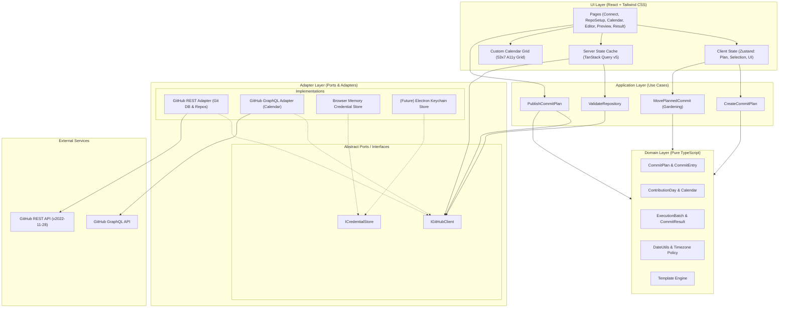

# GitHub Grass Gardener

GitHub Grass Gardener is a local-first web application for viewing your GitHub contribution calendar, planning commits for past dates, and publishing those commits to a repository's default branch.

The project calls editing an unpublished commit plan **Gardening**. It never changes the dates of existing commits, rewrites published history, or force-pushes a branch.

> [!IMPORTANT]
> A successful publish means that GitHub accepted the branch update. Whether a commit appears on your contribution calendar still depends on GitHub's contribution rules, account settings, and processing time.


## Features

- Connect to GitHub with a personal access token held only in browser memory.
- Load your real GitHub contribution calendar.
- Select dates and plan up to 20 commits per day and 100 commits per batch.
- Move or edit planned commits before they are published.
- Preview the target repository, branch, dates, and commit count before publishing.
- Publish real content changes through GitHub's Git Database API.
- Stop safely when the remote branch changes, permissions are insufficient, or GitHub applies a rate limit.
- Navigate the calendar with a keyboard and distinguish states without relying on color alone.

## How it works

1. Connect a GitHub account with a personal access token.
2. Select an existing repository or create a dedicated repository.
3. Choose dates on the contribution calendar and set the desired commit counts.
4. Review the complete plan and confirm publication explicitly.
5. Publish commits sequentially and inspect the resulting commit SHAs.

Each commit appends a real entry to `.grass-gardener/activity.jsonl`. Before publication, the application records the branch HEAD; immediately before writing, it checks that HEAD again. If the branch has changed, publication stops without writing anything.

## Architecture

The application follows a ports-and-adapters design. Domain code remains independent of React, browser APIs, and GitHub clients, while the application layer coordinates use cases through explicit interfaces.



See the [complete architecture and design document](docs/architecture.md#2-시스템-아키텍처-다이어그램) for layer responsibilities, control flows, and security decisions.

## Safety model

- Personal access tokens remain in memory and are never written to URLs, browser storage, repository files, fixtures, snapshots, or logs.
- Archived, disabled, read-only, and protected default branches are rejected before publication.
- Branch HEAD is checked during preview, before the batch starts, and before each commit.
- Branch references are updated with `force: false`; the application does not rewrite published history.
- GitHub writes are serialized and paced to reduce burst traffic. A rate-limit response stops the remaining batch.
- Failed or interrupted batches preserve successful commits and report failed and skipped entries separately.
- Future dates cannot be selected, and Gardening applies only to unpublished plans.

For a public deployment, the current browser-supplied PAT flow should be replaced with a GitHub App or an OAuth/BFF design.

## Requirements

- Node.js 18.18 or later
- pnpm 8
- A GitHub personal access token

## Getting started

```bash
pnpm install
pnpm dev
```

Open the local URL printed by Vite, connect your GitHub account, and follow the workflow from repository setup to publication. Because publishing writes to a real GitHub repository, verify the repository, branch, dates, and commit counts in the review step.

## GitHub token permissions

When creating a fine-grained personal access token, select the repository you want to use and configure these permissions:

| Permission | Access | Required | Used for |
| --- | --- | --- | --- |
| **Repository permissions → Contents** | **Read and write** | Yes | Reading the current branch and publishing commits |
| **Account permissions → Email addresses** | **Read-only** | Recommended | Loading verified email addresses for the commit author |

The **Contents: Read and write** permission is required to publish. The **Email addresses: Read-only** permission is optional; if it is unavailable, the application uses your GitHub-provided `noreply` address instead.

Additional permissions may be required in these cases:

- **Create a repository:** the token must permit repository creation. Fine-grained personal access tokens may reject this operation; select an existing repository if that happens.

Use a dedicated, least-privilege token and enter it only in a trusted local environment. Disconnecting or refreshing the page clears the token.

## Development commands

```bash
pnpm typecheck
pnpm lint
pnpm test
pnpm test:coverage
pnpm build
pnpm test:e2e
```

The end-to-end suite uses an installed Microsoft Edge browser and mocked GitHub API responses, so it does not modify a real repository.

## Documentation

- [Product definition](docs/product-definition.md)
- [Domain model](docs/domain-model.md)
- [Architecture and design](docs/architecture.md)
- [Authentication and security](docs/auth-and-security.md)
- [Commit publication flow](docs/commit-publication-flow.md)
- [GitHub contribution rules](docs/github-contribution-rules.md)
- [Trade-offs and risks](docs/trade-offs-and-risks.md)
- [Implementation plan](docs/implementation-plan.md)

Development workflow and repository-specific safety rules are documented in [AGENTS.md](AGENTS.md).
