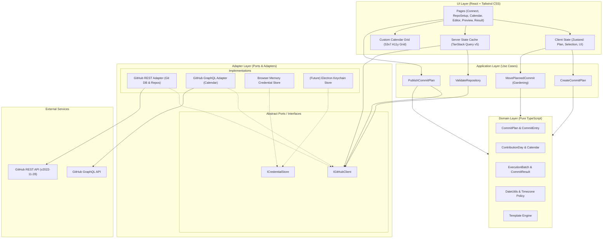
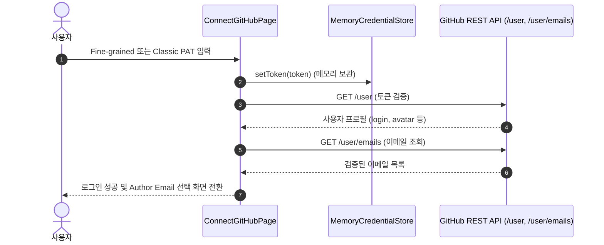
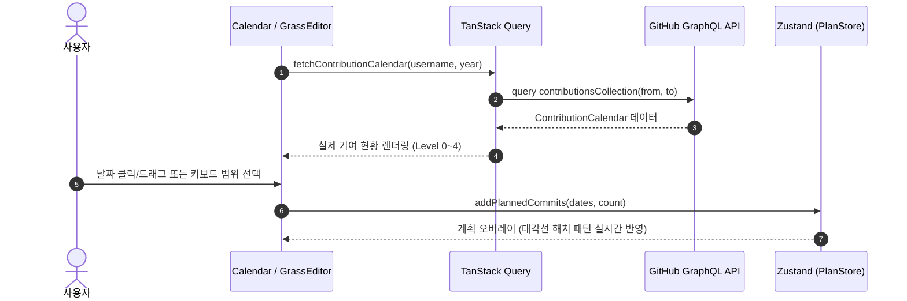
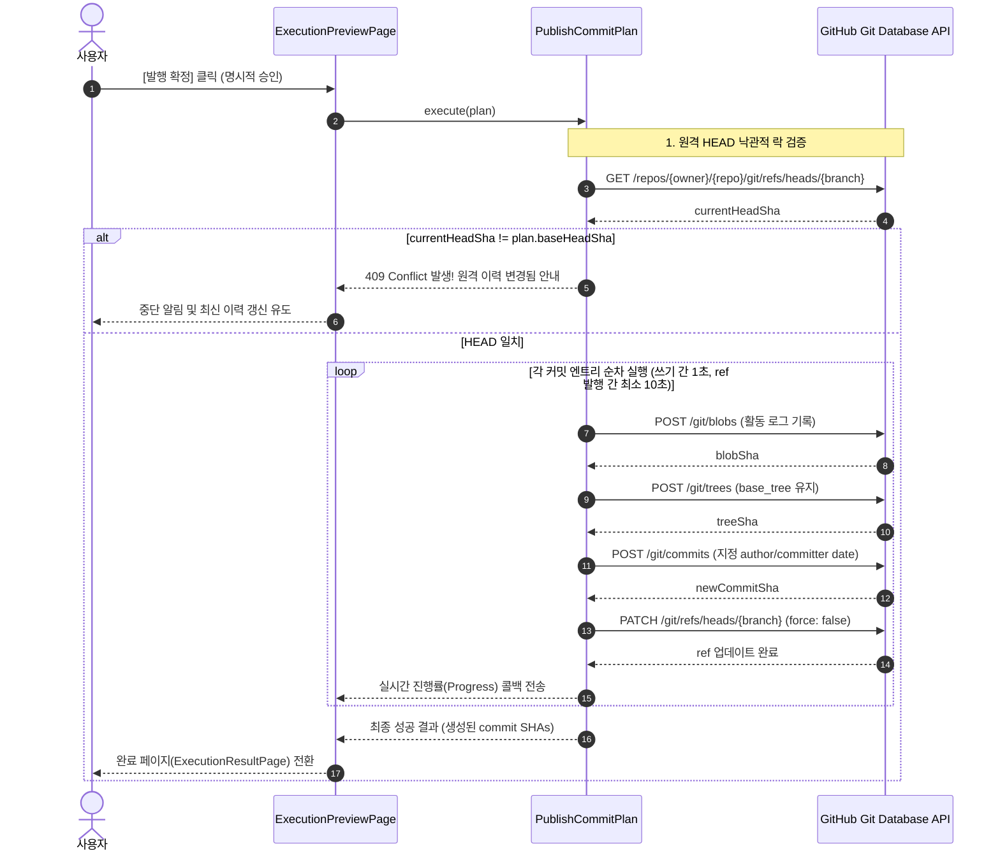

# GitHub Grass Gardener 시스템 아키텍처 (Architecture & Design)

## 1. 개요 및 설계 원칙

`github-grass-gardener`는 GitHub 기여 캘린더를 기반으로 날짜별 커밋을 시각적으로 계획하고, Git Database API를 통해 정확한 커밋을 생성·발행하는 애플리케이션이다.

### 1.1 핵심 설계 원칙

1. **관심사의 분리 (Separation of Concerns & Hexagonal Architecture)**
   - **Domain**: UI나 외부 인프라(GitHub API, 브라우저)에 전혀 의존하지 않는 순수 비즈니스 로직(TypeScript).
   - **Application**: 유스케이스(Use Cases) 오케스트레이션.
   - **Adapters**: 외부 API(GitHub REST/GraphQL, 자격증명 저장소)와의 통신 및 인터페이스 구현.
   - **UI**: React 컴포넌트, 상태 관리, 사용자 상호작용.
2. **보안 최우선 (Security-First)**
   - 개인 액세스 토큰(PAT)은 브라우저 영구 저장소(`localStorage`, `IndexedDB` 등)나 로그/URL에 노출하지 않고 메모리에만 유지한다.
3. **원격 이력 보호 및 원자성 (History Safety & Optimistic Locking)**
   - 커밋 발행 전후로 원격 HEAD의 일관성을 검증하며, Fast-forward가 불가능한 상황에서 절대 강제 푸시(`force: false`)하지 않는다.
4. **플랫폼 독립성 (Web & Electron 재사용성)**
   - Domain 및 Application 로직은 Web 환경뿐만 아니라 향후 Electron 환경에서도 그대로 재사용할 수 있도록 브라우저/DOM 전용 API에 결합되지 않는다.

---

## 2. 시스템 아키텍처 다이어그램

---

## 3. 계층별 상세 구성 및 책임

### 3.1 Domain Layer (`src/domain/`)

- **특징**: 외부 라이브러리(React, Octokit 등)나 환경 의존성이 없는 순수 TypeScript.
- **주요 모듈**:
  - `models/CommitPlan`: 배치 ID, 커밋 엔트리 목록, 기준 HEAD SHA, 작성자 정보 모델.
  - `models/ContributionDay`: GitHub 기여 캘린더 데이터(날짜, 기여 개수, 4분위 레벨).
  - `models/ExecutionBatch`: 커밋 발행 진행 상태 및 SHA 매핑, 에러 결과.
  - `services/date-utils`: IANA 시간대 기반 ISO 8601 생성, 날짜 경계 보정(정오 기본값), 미래 날짜 제한.
  - `services/template.service`: 일자별 커밋 메시지 및 `.grass-gardener/activity.jsonl` 파일 생성 로직.

### 3.2 Application Layer (`src/application/`)

- **특징**: 도메인 객체와 어댑터를 조율하여 사용자 의도를 완결하는 유스케이스 구현체.
- **주요 유스케이스**:
  - `CreateCommitPlan`: 선택한 날짜, 개수, 대상 저장소 정보를 바탕으로 유효한 `CommitPlan` 인스턴스 생성.
  - `ValidateRepository`: 대상 저장소의 Fork 여부, 아카이브/비활성화 상태, Default Branch 쓰기 권한 및 보호 브랜치 여부 검증.
  - `PublishCommitPlan`: 원격 HEAD 확인(낙관적 락) 후 Git Database 파이프라인을 순차 실행(쓰기 작업 간 Throttling 적용).
  - `MovePlannedCommit`: 아직 원격에 반영되지 않은 미발행 커밋 계획의 날짜 및 수량 조정(Gardening).

### 3.3 Adapter Layer (`src/adapters/`)

- **특징**: 외부 GitHub API 및 런타임 저장소와의 상호작용 캡슐화.
- **주요 어댑터**:
  - `github/github-graphql.client`: `contributionsCollection`을 통한 1년 단위의 기여 캘린더 조회.
  - `github/github-rest.client`: Git Database API(`blobs` → `trees` → `commits` → `refs`)를 활용한 커스텀 author/committer date 커밋 생성.
  - `credential/browser-credential.store`: 브라우저 메모리에만 토큰을 보유하는 휘발성 자격증명 스토어.

### 3.4 UI Layer (`src/ui/`)

- **특징**: Palantir 다크 테마 기반의 반응형 및 고접근성 인터페이스.
- **핵심 컴포넌트 & 상태**:
  - `ContributionCalendar`: 53주 × 7일 CSS Grid 기반의 커스텀 인터랙티브 캘린더 (WAI-ARIA Grid 규격 준수, Roving Tabindex).
  - `Zustand Store`: 현재 작업 중인 커밋 계획(`CommitPlan`), 드래그/범위 선택 영역(`SelectionState`).
  - `TanStack Query`: 사용자 프로필, 저장소 목록, 기여 캘린더 데이터 캐싱 및 재시도 관리.

---

## 4. 데이터 및 제어 흐름 (Data & Control Flow)

### 4.1 인증 및 환경 검증 흐름

### 4.2 캘린더 조회 및 계획 편집 흐름 (Gardening)

### 4.3 안전한 커밋 발행 파이프라인 (Publication Pipeline)

---

## 5. 보안 및 실행 안전 설계

1. **토큰 격리 (Token Sandboxing)**
   - 브라우저 스토리지(`localStorage`, `sessionStorage`, 쿠키)에 토큰을 절대 저장하지 않는다.
   - 새로고침 시 메모리가 초기화되어 재입력이 필요하지만, 악성 스크립트(XSS)나 브라우저 익스텐션으로부터 토큰 탈취 위험을 최소화한다.
2. **원격 브랜치 안전 (Ref Safety)**
   - `force: false` 옵션으로 `PATCH /git/refs`를 호출하여 Fast-forward 불가능 시 즉각 중단된다.
   - 사전에 보호 브랜치(Branch Protection) 여부 및 PR 필수 여부를 확인하여 권한 오류를 조기에 감지한다.
3. **API Rate Limiting 방어**
   - 커밋 생성 루프는 병렬(`Promise.all`)이 아닌 엄격한 직렬(Sequential) 방식으로 실행한다.
   - Blob·Tree·Commit·Ref 쓰기 요청 사이 최소 1000ms, 성공한 ref 갱신 후 다음 커밋 시작 전 10초를 기다려 GitHub API 제한과 저장소 push 빈도 권장치에 여유를 둔다.
   - GitHub의 속도 제한이 실제로 반환되면 자동 재시도 없이 멈추고 `Retry-After` 대기 시간을 안내한다. 이 간격만으로 기여 집계나 제한 회피가 보장되지는 않는다.
