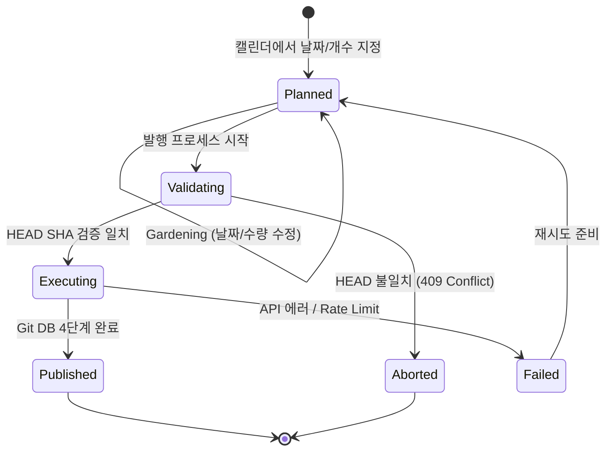

# GitHub Grass Gardener 도메인 및 API 데이터 모델 (Domain & API Data Model)

## 1. 도메인 데이터 모델 (Domain Models)

도메인 계층(`src/domain/models`)은 외부 프레임워크나 브라우저 API에 의존하지 않는 순수 TypeScript 타입과 인터페이스로 구성된다.

### 1.1 저장소 및 작성자 정보 (`RepositoryRef`, `AuthorInfo`)

```typescript
export interface RepositoryRef {
  owner: string; // e.g. "sVyu"
  name: string; // e.g. "grass-log"
  fullName: string; // e.g. "sVyu/grass-log"
  defaultBranch: string; // e.g. "main"
  isPrivate: boolean; // 비공개 여부
  isFork: boolean; // Fork 저장소 여부 (기여 집계 영향)
  isArchived: boolean; // 아카이브 여부 (선택 차단)
  hasPushAccess: boolean; // 쓰기 권한 보유 여부
}

export interface AuthorInfo {
  name: string; // Git 커밋 author/committer 이름
  email: string; // GitHub 계정에 등록 및 검증(verified)된 이메일
  username: string; // GitHub 로그인 ID
}
```

### 1.2 커밋 계획 및 엔트리 (`CommitPlan`, `CommitEntry`)

사용자가 캘린더 상에서 계획한 날짜별 커밋의 불변/가변 상태 모델.

```typescript
export type CommitEntryStatus = 'planned' | 'published' | 'failed' | 'skipped';

export interface CommitEntry {
  id: string; // UUID v4 (식별용)
  targetDate: string; // ISO 8601 Date: "YYYY-MM-DD"
  targetTime: string; // 시간: "HH:mm:ss" (기본값 "12:00:00")
  timezone: string; // IANA Timezone (e.g. "Asia/Seoul", "UTC")
  authorDateISO: string; // 최종 ISO 8601 타임스탬프 (e.g. "2026-05-15T12:00:00+09:00")
  message: string; // 커밋 메시지 (템플릿 적용 결과)
  contentPayload: string; // .grass-gardener/activity.jsonl에 기록될 내용
  status: CommitEntryStatus;
  commitSha?: string; // 발행 성공 시 반환된 Git Commit SHA
  errorMessage?: string; // 발행 실패 시 에러 내용
}

export interface CommitPlan {
  id: string; // Batch ID (e.g. "batch-20260923-xyz")
  targetRepo: RepositoryRef;
  author: AuthorInfo;
  baseHeadSha: string; // 계획 수립 시점의 remote branch 최신 HEAD SHA
  entries: CommitEntry[]; // 계획된 커밋 엔트리 목록 (날짜 오름차순 정렬)
  createdAt: string; // ISO 8601 타임스탬프
  updatedAt: string; // 최종 수정 타임스탬프
}
```

### 1.3 기여 캘린더 모델 (`ContributionCalendar`, `ContributionDay`)

GitHub GraphQL의 기여 수집 데이터를 UI와 도메인에서 다루기 편하게 정규화한 모델.

```typescript
export type ContributionLevel =
  | 'NONE' // 0회 (빈 셀)
  | 'FIRST_QUARTILE' // 1단계 (연한 초록)
  | 'SECOND_QUARTILE' // 2단계
  | 'THIRD_QUARTILE' // 3단계
  | 'FOURTH_QUARTILE'; // 4단계 (진한 초록)

export interface ContributionDay {
  date: string; // "YYYY-MM-DD"
  weekday: number; // 0 (일요일) ~ 6 (토요일)
  contributionCount: number; // 실제 확인된 기여 개수
  level: ContributionLevel; // GitHub 계산 분위수
  color: string; // GitHub 반환 컬러 코드
}

export interface ContributionWeek {
  firstDay: string; // 주의 첫날 날짜 "YYYY-MM-DD"
  contributionDays: ContributionDay[]; // 해당 주의 7개 일자 데이터
}

export interface ContributionMonth {
  name: string; // "Jan", "Feb" 등
  year: number; // 2026
  firstDay: string; // 해당 월 첫째 날
  totalWeeks: number; // 해당 월에 걸친 주 수
}

export interface ContributionCalendarData {
  totalContributions: number; // 해당 기간 총 기여수
  weeks: ContributionWeek[]; // 53주 데이터 (최대 371일)
  months: ContributionMonth[]; // 월 헤더 표시용
  year: number; // 기준 연도
}
```

### 1.4 실행 결과 및 배치 트래커 (`ExecutionBatch`, `CommitResult`)

```typescript
export type ExecutionStatus = 'idle' | 'validating' | 'running' | 'completed' | 'partial_failure' | 'aborted';

export interface CommitResult {
  entryId: string;
  targetDate: string;
  status: 'success' | 'failed' | 'skipped';
  commitSha?: string;
  error?: string;
  timestamp: string;
}

export interface ExecutionBatch {
  batchId: string;
  status: ExecutionStatus;
  startedAt: string;
  completedAt?: string;
  initialHeadSha: string;
  finalHeadSha?: string;
  totalCount: number;
  successCount: number;
  failedCount: number;
  results: CommitResult[];
}
```

---

## 2. GitHub API 규격 및 계약 (API Specifications)

### 2.1 GraphQL API — 기여 캘린더 조회

- **Endpoint**: `POST https://api.github.com/graphql`
- **권한 (PAT)**: 공개 기여는 추가 권한 불필요, 비공개 포함 시 사용자 설정 연동

#### Query 템플릿

```graphql
query GetContributionCalendar($username: String!, $from: DateTime, $to: DateTime) {
  user(login: $username) {
    contributionsCollection(from: $from, to: $to) {
      hasAnyContributions
      contributionCalendar {
        totalContributions
        weeks {
          firstDay
          contributionDays {
            date
            weekday
            contributionCount
            contributionLevel
            color
          }
        }
        months {
          name
          year
          firstDay
          totalWeeks
        }
      }
    }
  }
}
```

#### 제약 및 비즈니스 룰

- `from`과 `to` 간격은 **최대 1년(365일)**으로 제한됨.
- 특정 연도 조회 시: `from: "${year}-01-01T00:00:00Z"`, `to: "${year}-12-31T23:59:59Z"` 적용.

---

### 2.2 REST Git Database API — 저수준 커밋 파이프라인

임의의 author date와 committer date를 주입하기 위해 상위 Contents API 대신 Git Database API를 순차 사용한다.

| 순서  | HTTP 요청 | 경로                                            | 주요 인자                                                                                                  | 반환값                                     |
| :---- | :-------- | :---------------------------------------------- | :--------------------------------------------------------------------------------------------------------- | :----------------------------------------- |
| **0** | `GET`     | `/repos/{owner}/{repo}/git/refs/heads/{branch}` | None                                                                                                       | 현재 브랜치 HEAD commit SHA (`object.sha`) |
| **1** | `POST`    | `/repos/{owner}/{repo}/git/blobs`               | `{ content, encoding: "utf-8" }`                                                                           | `blob.sha`                                 |
| **2** | `POST`    | `/repos/{owner}/{repo}/git/trees`               | `{ base_tree: parentTreeSha, tree: [{ path, mode: "100644", type: "blob", sha: blobSha }] }`               | `tree.sha`                                 |
| **3** | `POST`    | `/repos/{owner}/{repo}/git/commits`             | `{ message, tree, parents: [parentSha], author: { name, email, date }, committer: { name, email, date } }` | `commit.sha`                               |
| **4** | `PATCH`   | `/repos/{owner}/{repo}/git/refs/heads/{branch}` | `{ sha: newCommitSha, force: false }`                                                                      | 갱신된 ref 정보                            |

#### 날짜 포맷 규칙

- `author.date` 및 `committer.date`: ISO 8601 형식 (e.g. `2026-05-15T12:00:00+09:00` 또는 `2026-05-15T03:00:00Z`).
- 프로필 잔디는 `author.date`의 타임존 및 날짜를 기준으로 GitHub가 집계한다.

---

### 2.3 REST Repositories API

- `GET /user/repos`: 사용자 접근 가능 저장소 목록 조회.
  - 필터: `fork == false`, `archived == false`, `disabled == false`, `permissions.push == true` 확인.
- `POST /user/repos`: 신규 앱 전용 저장소 생성.
  - Body: `{ name, description, private: true/false, auto_init: true }`
  - **중요**: 빈 저장소에서 Git Database API 호출 시 `409 Conflict`가 발생하므로 반드시 `auto_init: true`로 초기 커밋을 자동 생성한다.

---

### 2.4 REST Users & Emails API

- `GET /user`: 현재 토큰의 사용자 프로필 조회 (`login`, `id`, `avatar_url`, `name`).
- `GET /user/emails`: 등록된 이메일 배열 조회.
  - 조건: `verified: true`인 이메일만 커밋 author 후보로 노출.
  - 프라이버시 보호 계정인 경우 `{id}+{login}@users.noreply.github.com` 우선 권장.

---

## 3. 상태 모델 및 UI 상태 합성 (State Transitions & UI Synthesis)

### 3.1 커밋 엔트리 생명주기 (Lifecycle)



### 3.2 캘린더 셀 시각화 상태 합성 규칙

하나의 캘린더 셀은 실제 기여 상태와 계획 상태를 독립적인 레이어로 합성하여 표현한다.

```text
┌─────────────────────────────────────────────────────────────┐
│ [Layer 3: Top-Right Badge] 에러 상태 시 빨간색 원형 뱃지        │
│ [Layer 2: Hatch Pattern]   계획된 커밋 존재 시 파란 대각선 해치   │
│ [Layer 1: Border Ring]     발행 완료(초록) / 선택(코발트블루) 링 │
│ [Layer 0: Base Surface]    실제 기여 레벨(Level 0 ~ 4) 배경색   │
└─────────────────────────────────────────────────────────────┘
```

1. **Base Layer (실제 기여)**:
   - Level 0: `#252A31` (배경 다크 그레이)
   - Level 1: `#165A36`
   - Level 2: `#1A7A44`
   - Level 3: `#239F57`
   - Level 4: `#72CA9B`
2. **Planned Overlay (미발행 계획)**:
   - `plannedCount > 0`일 때, CSS `repeating-linear-gradient(45deg, ...)`로 45도 스트라이프 패턴을 덧씌움.
3. **Status Ring (발행/에러/선택)**:
   - 선택된 셀: `ring-2 ring-[#4D9CFF]` (코발트 블루)
   - 발행 완료 셀: `ring-1 ring-[#72CA9B]` (에메랄드 링)
   - 실패 셀: `ring-1 ring-[#FA999C]` 및 코너 에러 닷(Dot)
