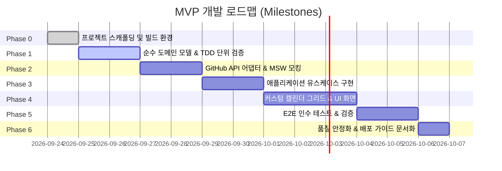

# GitHub Grass Gardener MVP 구현 계획서 (Implementation Plan)

## 1. 개요 및 구현 로드맵

본 문서는 `github-grass-gardener` MVP(Minimum Viable Product)를 구축하기 위한 세부 구현 계획서이다.  
개발은 **SDD(Specification-Driven Development) → TDD(Test-Driven Development) → Implementation** 절차를 엄격히 준수하며, 각 계층의 관심사 분리를 철저히 유지한다.

---

## 2. 단계별 세부 구현 태스크

### Phase 0: 프로젝트 스캐폴딩 및 기반 환경 구축

- [ ] **빌드 & 패키지 설정**:
  - `pnpm create vite@latest . --template react-ts` 기반 초기화
  - Tailwind CSS v4 (`@tailwindcss/vite`, `tailwindcss`) 설정
  - Strict TypeScript 환경 구성 (`tsconfig.json`: `noUncheckedIndexedAccess: true`, `@/*` alias)
- [ ] **품질 도구 구성**:
  - ESLint v9 Flat config (`eslint.config.js`) + Prettier
  - Vitest + React Testing Library 테스트 환경 (`vite.config.ts`, `test/setup.ts`)
  - MSW v2 (Mock Service Worker) 브라우저 및 Node 환경 핸들러 골격
- [ ] **디렉토리 구조 확립**:
  - `src/domain/`, `src/application/`, `src/adapters/`, `src/ui/` 분리

---

### Phase 1: 도메인 계층 구현 (TDD)

외부 환경(DOM, React, GitHub API)에 의존하지 않는 순수 비즈니스 로직 작성.

- [ ] **날짜 및 시간대 유틸리티 (`src/domain/services/date-utils.ts`)**:
  - `toAuthorDateISO(date, time, timezone)`: IANA 타임존 오프셋 계산 (date-fns 기반)
  - `isDateInFuture(date, timezone)`: 미래 날짜 선택 차단 로직 (CAL-008)
  - `getDefaultCommitTime()`: 날짜 경계 오류 방지 정오("12:00:00") 기본값 (CAL-010)
  - _단위 테스트 우선 작성_: 타임존 변환, 서머타임, 윤년 경계 케이스 검증
- [ ] **도메인 모델 정의 (`src/domain/models/`)**:
  - `CommitPlan.ts`: 커밋 계획, 엔트리 상태, 불변성 보장 메서드
  - `ContributionDay.ts`: GraphQL 캘린더 데이터 타입 정규화
  - `ExecutionBatch.ts`: 배치 실행 상태 추적 모델
- [ ] **커밋 계획 및 Gardening 서비스 (`src/domain/services/commit-plan.service.ts`)**:
  - 계획 생성, 일자별 커밋 추가/제거
  - 미발행 엔트리 일괄 날짜 이동(Gardening 로직)
  - 유효성 검사 (최대 커밋 개수 초과 방지, 미래 날짜 검증)
- [ ] **템플릿 서비스 (`src/domain/services/template.service.ts`)**:
  - 평일 패턴, 균일 패턴, 랜덤 패턴 생성 알고리즘
  - `.grass-gardener/activity.jsonl` 페이로드 빌더 (GRASS-005)

---

### Phase 2: 어댑터 계층 구현 (외부 연동)

- [ ] **인증 및 자격증명 스토어 (`src/adapters/credential/`)**:
  - `credential-store.port.ts`: 포트 인터페이스 선언
  - `browser-credential.store.ts`: 메모리 전용 스토어 구현 (새로고침 시 초기화, XSS 방어)
- [ ] **GitHub GraphQL 클라이언트 (`src/adapters/github/github-graphql.client.ts`)**:
  - `@octokit/graphql` 연동
  - `contributionsCollection` 쿼리 실행 및 1년 단위 정규화 파싱
  - MSW 기반 목 핸들러 및 네트워크 실패 대응 테스트
- [ ] **GitHub REST Git Database 클라이언트 (`src/adapters/github/github-rest.client.ts`)**:
  - `@octokit/rest` 연동
  - 저수준 파이프라인 함수: `getBranchHeadRef` → `createBlob` → `createTree` → `createCommit` → `updateRef`
  - `force: false` 검증 (Fast-forward 불가능 시 안전 중단)
  - 직렬 Throttling 큐 (뮤테이션 간 1000ms sleep) 및 `Retry-After` 백오프 구현
- [ ] **GitHub 저장소 및 사용자 클라이언트 (`src/adapters/github/github-repo.client.ts`)**:
  - `GET /user`, `GET /user/emails` (verified 이메일만 추출)
  - `GET /user/repos` (Fork/Archived/Disabled/Permissions 필터링)
  - `POST /user/repos` (`auto_init: true` 적용)

---

### Phase 3: 애플리케이션 계층 (Use Cases)

- [ ] `ValidateRepository`: 대상 저장소의 적합성(Fork 여부, 푸시 권한, 브랜치 보호) 판정
- [ ] `CreateCommitPlan`: 사용자 입력과 remote HEAD를 조합한 신규 `CommitPlan` 인스턴스 빌드
- [ ] `MovePlannedCommit`: Gardening 요청 시 미발행 계획 안전 재배치
- [ ] `PublishCommitPlan`:
  - 1단계: 원격 HEAD 일치 여부 대조 (낙관적 락)
  - 2단계: Git DB 직렬 파이프라인 구동 및 진행률(Progress) 브로드캐스트
  - 3단계: 실패 시 부분 성공 SHA 및 재시도 가능 목록 취합 반환

---

### Phase 4: UI 계층 구현 (React + Tailwind CSS)

- [ ] **디자인 시스템 & 토큰 (`src/index.css`)**:
  - Palantir 다크 테마 컬러 팔레트 구축 (`#111418`, `#1C2127`, `#252A31`, `#72CA9B`, `#4D9CFF`)
- [ ] **커스텀 기여 캘린더 그리드 (`src/ui/components/calendar/`)**:
  - `ContributionCalendar.tsx`: 컨테이너 및 ARIA grid 래퍼 (`role="grid"`)
  - `CalendarGrid.tsx`: 53주 × 7일 CSS Grid 렌더링 및 월/요일 레이블
  - `DayCell.tsx`: 4계층 상태 합성 (기여 배경색 + 대각선 해치 패턴 + 상태 링 + 뱃지)
  - `useHeatmapKeyboard.ts`: Roving tabindex 기반 2D 키보드 탐색 (방향키, Shift+범위선택)
  - `useHeatmapSelection.ts`: 마우스/터치 드래그 다중 선택 이벤트 제어
  - Radix UI Tooltip 연동 (날짜, 실제 기여, 계획 개수, 상태 안내)
- [ ] **클라이언트 상태 관리**:
  - TanStack Query: 사용자 정보, 저장소 목록, 기여 캘린더 캐싱
  - Zustand `plan.store.ts`: 편집 중인 커밋 계획 및 선택 영역 관리
- [ ] **페이지 컴포넌트 (`src/ui/pages/`)**:
  - `ConnectGitHubPage`: PAT 입력 폼, 권한 체크리스트, 프로필 확인
  - `RepositorySetupPage`: 저장소 선택, Fork 경고, 전용 저장소 신규 생성 모달
  - `CalendarPage` & `GrassEditorPage`: 캘린더 뷰, 잔디 심기 수량 조절 슬라이더/인풋, 템플릿 선택기
  - `ExecutionPreviewPage`: 발행 전 최종 확인 (총 커밋 수, 날짜 목록, 예상 SHA 변화)
  - `ExecutionResultPage`: 발행 진행률 프로그레스바, 생성 완료 커밋 SHA 목록, GitHub 링크

---

### Phase 5: 테스팅 및 품질 검증

- [ ] **단위 및 도메인 테스트**: `pnpm test` (날짜 변환, 계획 생성/수정, 낙관적 락)
- [ ] **MSW 통합 테스트**: API 에러(`401`, `403`, `409`, `429`) 발생 시의 UI 회복 탄력성 검증
- [ ] **Playwright E2E 테스트**:
  - 시나리오 1: 토큰 입력 → 저장소 선택 → 3일간 커밋 계획 → 발행 성공
  - 시나리오 2: 원격 HEAD 불일치 시 409 Conflict 차단 및 에러 안내
  - 시나리오 3: Fork 저장소 선택 시 경고 배너 및 생성 제한 안내

---

### Phase 6: 문서화 및 가이드

- [ ] `docs/adr/`: 아키텍처 결정 기록(ADR) 작성
- [ ] 루트 `AGENTS.md`: 에이전트 작업 원칙 및 안전 수칙 명시
- [ ] `README.md`: 프로젝트 개요, 로컬 실행 방법, PAT 발급 가이드 갱신

---

## 3. 완료 정의 (Definition of Done)

1. **빌드 및 린트**: TypeScript 컴파일(`tsc --noEmit`) 및 ESLint 에러 0건.
2. **테스트 커버리지**: 도메인 및 애플리케이션 계층 유닛 테스트 커버리지 90% 이상 달성.
3. **보안 기준**: 코드베이스, 번들링 파일, 콘솔 로그 어디에도 사용자 PAT가 남지 않음.
4. **접근성(a11y)**: 캘린더의 모든 날짜를 키보드(Tab + Arrow keys)로 접근 및 선택 가능.
5. **안전성**: HEAD 불일치 시 `force push` 없이 즉각 중단되고 사용자에게 통지됨.
