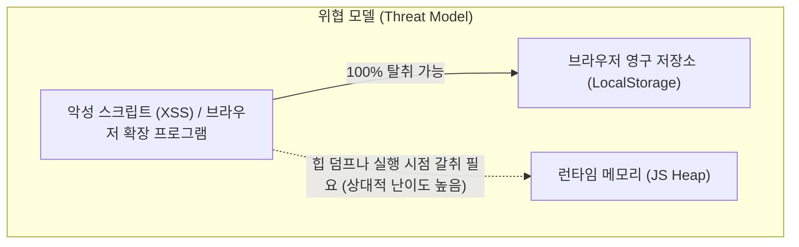

# GitHub Grass Gardener 기술적 트레이드오프 및 리스크 분석 (Trade-offs & Risks)

## 1. UI 히트맵 구현 방식: 커스텀 CSS Grid vs 서드파티 SVG 라이브러리

### 1.1 대안 검토

- **대안 A (서드파티 라이브러리)**: `react-calendar-heatmap`, `react-activity-calendar`, `@uiw/react-heat-map` 등 사용
- **대안 B (커스텀 빌드)**: HTML/CSS Grid(53×7) + Tailwind CSS + Radix Tooltip 자체 구축

### 1.2 트레이드오프 분석

| 비교 기준                | 대안 A (기존 SVG 라이브러리)                                | 대안 B (커스텀 CSS Grid 빌드) — **채택**                        |
| :----------------------- | :---------------------------------------------------------- | :-------------------------------------------------------------- |
| **초기 개발 공수**       | 낮음 (패키지 설치 후 데이터 바인딩)                         | 보통 (~350 LOC 작성 필요)                                       |
| **인터랙티브 편집**      | ❌ 불가. SVG `<rect>` 클릭 외 드래그/범위 선택 미지원       | ✅ 완벽 지원. Pointer Capture 및 마우스/터치 드래그 연동        |
| **복합 상태 시각화**     | ❌ 극도로 어려움. SVG 내부 복합 엘리먼트/패턴 주입 복잡     | ✅ 매우 쉬움. CSS 그라데이션 해치, 링, 뱃지 등 다층 레이어 구성 |
| **웹 접근성 (a11y)**     | ❌ 열악함. SVG 요소는 키보드 포커스 및 스크린리더 지원 미흡 | ✅ 뛰어남. WAI-ARIA Grid (`role="grid"`), Roving Tabindex 구현  |
| **디자인 시스템 일관성** | ⚠️ SVG 내부 fill/stroke 오버라이드 번거로움                 | ✅ 100% Tailwind CSS 및 Palantir 다크 테마 토큰과 직결          |

### 1.3 결정 및 근거

- GitHub 프로필의 잔디 그래프 역시 2023년 3월 접근성 강화를 위해 SVG에서 HTML `table` 및 ARIA Grid 구조로 전면 전환하였다.
- 잔디 가드너의 핵심 기능은 단순 열람이 아닌 **"날짜 드래그 선택 및 개수 편집"**이므로, 서드파티 라이브러리의 구조적 한계(SVG 벽)를 우회하기보다 **커스텀 CSS Grid를 직접 구축하는 것이 장기적으로 유지보수 비용이 훨씬 낮다.**

---

## 2. 인증 및 자격증명 보안: 메모리 전용 vs 영구 스토리지

### 2.1 대안 검토

- **대안 A**: `localStorage` 또는 `IndexedDB`에 PAT 저장 (자동 로그인 편의성)
- **대안 B**: 브라우저 런타임 메모리(React/Zustand State)에만 유지 — **채택**

### 2.2 리스크 및 완화 방안



- **리스크**: 새로고침(F5) 시 토큰이 소멸되어 사용자가 다시 입력해야 하는 UX 불편 발생.
- **결정 근거**:
  - PAT는 사용자 계정의 저장소 쓰기 권한(`Contents: write`)을 보유한 민감 자격증명이다. 순수 클라이언트 SPA 환경에서는 XSS 공격 발생 시 `localStorage`의 모든 데이터가 즉시 탈취된다.
  - 보안 원칙(Security-First)에 따라 Web MVP에서는 영구 저장소를 배제하고 메모리에만 유지한다.
  - 향후 Electron 클라이언트로 확장 시 OS 키체인(Keytar / safeStorage)을 활용하여 보안과 편의성을 동시에 확보한다.

### 2.3 Fine-grained PAT의 제약 및 대응

- **리스크**: Fine-grained PAT는 리포지토리 단위로 스코프가 격리되므로, 개인 계정에서 신규 저장소를 생성(`POST /user/repos`)할 때 `403 Resource not accessible` 오류가 발생할 수 있다.
- **완화 대책**:
  1. 사전 가이드에서 "Classic PAT (with `repo` scope)"와 "Fine-grained PAT"의 차이점을 명확히 안내한다.
  2. 신규 생성 실패 시 사용자에게 기존 저장소를 선택하도록 유도하거나 Classic PAT 전환 경로를 안내하는 Fallback UI를 제공한다.

---

## 3. Git 이력 관리: 신규 커밋 생성 vs 원격 이력 재작성 (History Rewrite)

### 3.1 리스크 분석

```text
[History Rewrite 발생 시 Git 트리 변화]
기존: A ── B ── C ── D (main)
수정: A ── B' ── C' ── D' (main - Force Push 강제 필요)
```

- 특정 커밋의 날짜를 과거로 수정하면 해당 커밋부터 이후의 **모든 커밋 SHA가 영구적으로 변조**된다.
- 협업 중인 저장소일 경우 다른 개발자의 로컬 복제본과 브랜치가 심각하게 깨진다.
- 브랜치 보호 규칙(Protected Branch)이 적용된 경우 원격 거부(`403`)로 작업이 중단된다.

### 3.2 결정 및 안전 조치

- **Gardening의 범위를 '발행 전 계획 수정'으로 엄격히 한정한다.**
- 이미 GitHub 원격에 발행된 커밋은 MVP에서 **읽기 전용**으로만 표시하며 절대 수정/삭제하지 않는다.
- 오직 앱 전용 저장소(Default Branch)에 새로운 날짜의 커밋을 덧붙이는(Append-only) 안전 모드만 지원한다.

---

## 4. API 속도 제한 (Rate Limits) 및 동시성 제어

### 4.1 리스크 분석

- 1년에 수십~수백 개의 커밋을 심기 위해 짧은 시간 동안 많은 수의 Git DB 요청을 발생시키면 GitHub **Secondary Rate Limit**(남용 방지 시스템)에 의해 차단(`429 Too Many Requests` 또는 `403 Forbidden`)된다.
- `Promise.all`과 같은 비동기 병렬 요청은 GitHub 인프라에서 즉각적인 2차 제한 트리거가 된다.

### 4.2 완화 설계 (Throttling & Sequential Queue)

1. **직렬 파이프라인 (Sequential Execution)**:
   - 커밋 생성(Blob → Tree → Commit → Ref)은 반드시 1개씩 순차적으로 실행한다.
2. **인위적 지연 (Inter-request Sleep)**:
   - 커밋 1회 완료 후 다음 커밋 시작 전 최소 **1,000ms ~ 1,500ms** 대기한다.
3. **낙관적 락 (Optimistic Locking)**:
   - 발행 직전 현재 원격 HEAD SHA가 계획 생성 시점의 `baseHeadSha`와 일치하는지 대조하여 다른 곳에서의 변경으로 인한 이력 꼬임을 원천 차단한다.
4. **Retry-After 헤더 존중**:
   - `429` 또는 `Retry-After` 헤더 응답 시, 지시된 초만큼 카운트다운 타이머를 실행하고 사용자에게 대기 상태를 실시간 표시한다.

---

## 5. GitHub 기여 집계 규칙 불일치 리스크

| 위험 요인             | 발생 원인                                             | 영향                                      | 제품 내 사전 방어 대책                                                      |
| :-------------------- | :---------------------------------------------------- | :---------------------------------------- | :-------------------------------------------------------------------------- |
| **이메일 불일치**     | GitHub 계정에 미등록되었거나 unverified된 이메일 사용 | 커밋은 생성되나 잔디에 반영 안 됨         | `GET /user/emails`를 호출하여 `verified: true`인 이메일만 셀렉트박스로 제공 |
| **Fork 저장소**       | Fork한 저장소에 커밋 발행                             | GitHub 정책 상 Fork 커밋은 기여 집계 제외 | 저장소 검증 시 Fork 여부를 식별하여 경고 배너 및 앱 전용 저장소 생성 권장   |
| **Default 브랜치 외** | `feature` 브랜치 등에 커밋 푸시                       | 기여 캘린더 미집계                        | 저장소 메타데이터의 `default_branch`로만 커밋 대상을 고정                   |
| **미래 날짜 커밋**    | 시스템 시계보다 미래 시점 날짜 설정                   | 기여로 즉시 카운트되지 않거나 무시됨      | IANA 타임존 기준 오늘 이후 날짜는 캘린더에서 선택 불가 처리 (CAL-008)       |

---

## 6. 리스크 관리 요약 매트릭스 (Risk Matrix)

| 리스크 항목                         | 발생 가능성 | 영향도 | 완화 전략                                                           |
| :---------------------------------- | :---------: | :----: | :------------------------------------------------------------------ |
| **토큰 유출 (XSS)**                 |    중간     |  높음  | 메모리 전용 보관, CSP 헤더, 로그 마스킹                             |
| **API 차단 (Secondary Rate Limit)** |    높음     |  중간  | 1초 직렬 쓰기 Throttling, 배치 크기 제한(~100건)                    |
| **원격 커밋 충돌 (409 Conflict)**   |    낮음     |  높음  | 발행 전 HEAD SHA 대조, `force: false` 적용                          |
| **잔디 미반영에 따른 사용자 혼선**  |    높음     |  낮음  | 사전 Preflight Check(이메일, Fork, 브랜치 검증) 및 기여 비보장 고지 |
| **캘린더 드래그 조작 렉/성능 저하** |    낮음     |  중간  | 53×7 셀의 불필요한 리렌더링 방지 (React.memo, Roving tabindex)      |
